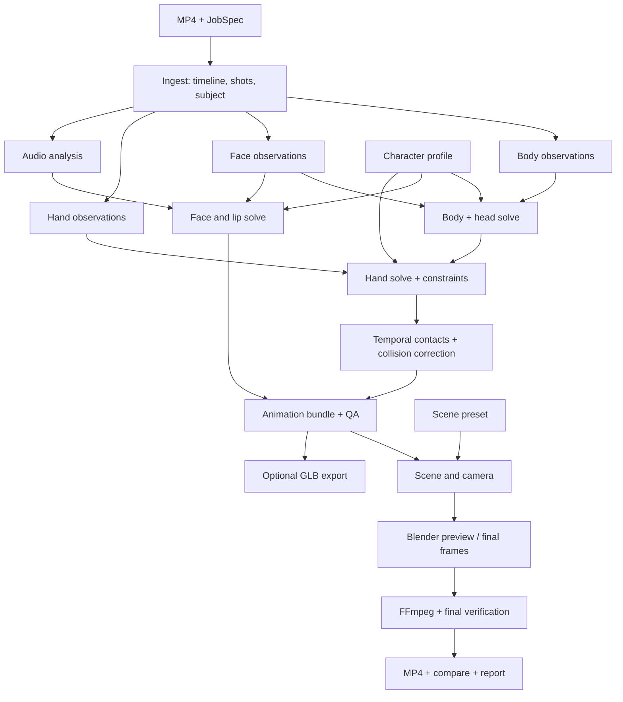

# Xandra Motion Studio — архитектура автоматизированного производства клипов

Дата: 9 октября 2026 года. Статус: проект архитектуры; реализация ещё не создана.

## 1. Какой продукт предлагается

Локальное приложение и CLI: пользователь передаёт MP4, выбирает зарегистрированного персонажа и сцену, получает MP4 с этим персонажем, повторяющим движение, мимику и артикуляцию человека. Для обычного случая достаточно входного файла: персонаж, сцена и качество берутся из сохранённого профиля.

Основной результат — качественное видео уровня постановки `clip02`, а не только проверочная анимация на сером фоне. Система автоматически строит синхронную анимацию тела, головы, глаз, лица и кистей, исправляет контакты, ставит камеру, рендерит и добавляет исходный звук.

Обязательные результаты успешного задания:

- `video.mp4`: основной ролик 1080×1920, H.264/AAC, без звука, если его нет во входе;
- `compare.mp4`: оригинал и модель на одной временной шкале;
- `quality.json` и `report.html`: измерения, предупреждения, контрольные изображения и происхождение результата;
- воспроизводимый animation bundle и manifest задания.

Опционально: крупный план лица, GLB с новым клипом, производный `.blend` с собранной сценой. GLB не является промежуточной зависимостью основного процесса.

Под «похожим output» понимается исполнение движений и выражения на Xandra с оформленной сценой. Автоматическое восстановление комнаты, одежды человека и освещения исходного видео не входит в основной контракт: внешний вид задаётся шаблоном сцены и персонажем. Существующая спальня — первый шаблон.

Первая целевая среда — имеющийся Mac с Blender 4.5 LTS. Первый персонаж — существующая Xandra. Архитектура допускает других персонажей через регистрацию профиля, но произвольный неизвестный GLB не считается автоматически совместимым.

Первый проверяемый класс входов: короткие ролики примерно 5–30 секунд, один основной человек, в основном видимое тело и лицо, без монтажных склеек и сильного движения камеры. Это область приёмки первой версии, а не обрезка длительности: более длинные ролики обрабатываются окнами при достаточных ресурсах. Сложные входы получают измеримый статус качества и описанные ниже варианты деградации.

## 2. Что изменится относительно архивных проектов

| Наблюдавшаяся проблема | Предлагаемое решение |
| --- | --- |
| Разрозненные скрипты с `/workspace` | Пакет с CLI, общей конфигурацией и версионированными интерфейсами стадий |
| Кисти требуют ранее экспортированный GLB | Скелет и rest transforms берутся из профиля персонажа, движение предплечья — из общего animation bundle |
| Калибровка по фиксированным кадрам и A-позе | Поиск надёжных участков, геометрия целевого рига и оценка параметров по всему отрезку |
| Ручное усиление головы в окнах секунд | Отдельное решение головы по лицевому трекингу и пределам шеи; художественный gain задаётся профилем, не таймкодами |
| Рот = постоянная сумма видео и аудио | Смешивание по качеству наблюдения и артикуляционным ограничениям |
| Collision pass иногда резко меняет плечо | Контакты входят в общий временной solve, после него выполняется геометрическая проверка |
| PNG считается готовым по наличию файла | Содержательный ключ кэша, проверка изображения и атомарная запись |
| Рендер и экспорт используют разные версии движения | Один утверждённый bundle и его hash для всех потребителей |
| Старые отчёты выглядят как проверка нового результата | Метрики всегда привязаны к hash анимации, сцены, профиля и конкретного запуска |
| Последний FFmpeg-этап может сломаться после дорогого рендера | Предварительная проверка сборки и нормализация размеров всех сравнительных потоков |

## 3. Стек и обоснование

| Компонент | Выбор для первой версии | Зачем |
| --- | --- | --- |
| Оркестрация | Python-пакет, типизированные конфигурации, SQLite + файловые артефакты | Одна машина, простая установка и восстановление без инфраструктуры сервера |
| Видео/звук | FFmpeg и FFprobe | Декодирование, временные метки, форматы и финальная сборка |
| Тело/лицо/кисти | MediaPipe Tasks с закреплёнными моделями | Практический локальный baseline, уже подтверждённый материалами проекта |
| Численная обработка | NumPy, SciPy; собственное FK/IK и временной оптимизатор | Управление пропорциями, контактами и плавностью без привязки к Blender |
| Геометрические расстояния | Адаптер libigl; простые прокси для быстрой стадии | Сначала дешёвая коррекция, затем проверка реальной деформированной поверхности |
| Выделение голоса | Изолированный адаптер Demucs/htdemucs | Повторение рабочего подхода с возможностью заменить backend |
| Аудиоформы рта | Rhubarb как вспомогательный backend, envelope отдельно | Дополнение видеотрекинга; отсутствие текста песни не блокирует вход |
| Финальный рендер | Blender EEVEE, закреплённый build 4.5 LTS | Использование исходного персонажа и качественных `.blend`-сцен |
| Preview | Тот же Blender и материал-профиль, меньше разрешение/samples | Избежать ложного preview с другой моделью освещения |
| GLB | Прямое добавление костных и morph weight каналов в копию зарегистрированного GLB | Сохранность базового файла, независимость от Blender export |
| Интерфейс | Сначала CLI; затем небольшой локальный UI поверх того же Job API | UI не содержит вторую реализацию pipeline |

MediaPipe предоставляет точки тела в изображении и пространственную оценку, а Face Landmarker — blendshape scores и матрицы лица. Это наблюдения для последующего решения, не готовый motion capture. [Pose Landmarker source](https://github.com/google-ai-edge/mediapipe/blob/master/mediapipe/tasks/python/vision/pose_landmarker.py), [FaceLandmarkerResult](https://ai.google.dev/edge/api/mediapipe/python/mp/tasks/vision/FaceLandmarkerResult).

Для кистей используются отдельные Hand Landmarker результаты с нормализованными и world landmarks. [Hand Landmarker source](https://github.com/google-ai-edge/mediapipe/blob/master/mediapipe/tasks/python/vision/hand_landmarker.py).

Rhubarb создаёт категории форм рта для записи голоса, поддерживает JSON и необязательный текст. Он не объявляется точным распознавателем артикуляции пения. В нашем проекте видеонаблюдение остаётся главным, если лицо хорошо видно. [Rhubarb](https://github.com/DanielSWolf/rhubarb-lip-sync).

Оригинальный репозиторий Demucs архивирован с 1 января 2025 года. Поэтому backend закрепляется и изолируется, а не становится фундаментальной зависимостью ядра. Совместимость и скорость на Mac подлежат отдельной проверке перед фиксацией environment lock. [Demucs](https://github.com/facebookresearch/demucs).

SciPy `least_squares` поддерживает bounds и robust losses и подходит для первого ограниченного по размеру solve. Масштабирование на длинные ролики решается оконной обработкой, а не обещанием оптимизировать весь фильм одной плотной задачей. [SciPy](https://docs.scipy.org/doc/scipy/reference/generated/scipy.optimize.least_squares.html).

Рендер запускается отдельным Blender-процессом. Работа с actions изолируется в адаптере: новый код не полагается на старый `action.fcurves` во всех версиях. Изменения slotted actions официально описаны Blender. [Command line](https://docs.blender.org/manual/en/4.5/advanced/command_line/index.html), [Actions migration](https://developer.blender.org/docs/release_notes/4.4/animation_rigging/).

Тяжёлую GPU-модель восстановления движения или генеративную перерисовку кадров не включаю в обязательный путь. Они увеличат требования и усложнят сохранение идентичности Xandra. Позднее можно подключить альтернативный pose backend через существующий контракт и сравнить на контрольном наборе.

## 4. Архитектура модулей



Body, face, hands и audio могут логически работать независимо после ingest. На Mac исполнитель ограничивает параллельность памятью; диаграмма не требует одновременного запуска всех ML-моделей. GPU-рендер по умолчанию один.

## 5. Общие данные: AnimationBundle v1

Промежуточная анимация — независимый от Blender формат, `metadata.json` + бинарные массивы NPZ с запретом pickle. Для длинных заданий допускаются chunked NPZ по времени. GLB и actions создаются только адаптерами из этого формата.

Основные поля:

| Поле | Содержание |
| --- | --- |
| `schema_version`, `character_profile_hash` | Версия формата и точное соответствие целевому ригу |
| `sample_times_s` | Явные возрастающие отсчёты в секундах относительно начала выбранного клипа |
| `joint_names`, `parent_indices` | Именованная иерархия; индекс не является универсальным именем кости |
| `rest_local_trs` | Rest transforms, метры, единый контракт координат |
| `root_translation`, `local_rotation_delta` | Перемещение управляющего корня и кватернионные отклонения от rest |
| `face_channel_names`, `face_weights` | Лицевые каналы в семантическом пространстве с диапазонами профиля |
| `confidence`, `validity`, `provenance` | Достоверность и источник для каждой группы каналов/отрезка |
| `contacts`, `events` | Контакты стоп, ладоней, прыжки, потери трекинга |
| `source_time_map` | Соответствие исходным PTS; позволяет сравнение и повторный монтаж |
| `head_owner`, `eye_owner`, `jaw_owner` | Кто управляет каждой степенью свободы, чтобы не применить движение дважды |

Каноническое пространство: метры, правая система координат, +Y вверх, персонаж смотрит в +Z; кватернион `(x,y,z,w)`. Blender-адаптер делает явное преобразование в Z-up. Импорт GLB и обратная проверка пользуются тем же контрактом.

Базовый контракт rotations: `R_local = R_rest_local × R_delta`; полная FK учитывает rest translation и scale. В сложных ригах адаптер должен использовать эквивалент Blender bone conversion, а не предполагать одинаковую ориентацию всех костей. Масштаб/поворот armature и единицы проверяются при регистрации.

Пропорции модели не растягиваются вслед за шумом трекинга. Translation обычных конечностей остаётся rest, кроме явно разрешённых костей. Для Xandra адаптер может переносить world root motion в pelvis согласно профилю; не добавляет его одновременно на объект и таз.

Имена MediaPipe не считаются автоматически равными 52 слотам модели: `_neutral` и несовпадения исключаются по имени; порядок и aliases задаются профилем. Дублирующиеся морфы получают явные правила, чтобы не удвоить улыбку.

## 6. Профиль персонажа и шаблон сцены

Однократная регистрация персонажа создаёт `character.json`, `rig.npz`, `face_map.json`, прокси коллизий и связи с `.blend`/GLB. Исходные файлы читаются без изменения.

Профиль включает:

- пути и hashes исходных assets, версии подготовки;
- роли костей, rest pose, лимиты суставов и индивидуальные оси сгиба;
- управляющий корень, контактные точки подошв и ладоней;
- семантику лицевых морфов, aliases, gain, нейтральные offsets и диапазоны;
- управление глазами и челюстью: bone либо morph для каждой роли;
- положение пола, геометрию препятствий, skin/cloth margins;
- цветовой и материал-профиль для Blender и экспортной модели.

Особенности Xandra, такие как `mouthSmileRightold`, находятся здесь. Настройка зубов выполняется при подготовке производного character asset и документируется; не меняет каноническую модель при каждом клипе и не переносится вслепую на другого персонажа. Можно иметь варианты `natural` и `soft_lips`, согласованные для Blender и GLB.

Шаблон сцены включает `.blend`, коллекцию окружения, world, освещение, floor transform, область постановки, разрешённые камеры и диапазон экспозиции. Персонаж отделён от среды. Существующая спальня используется как первый подготовленный шаблон; автоматическая загрузка Poly Haven при каждом запуске не нужна.

При регистрации автоматически рендерятся тестовая поза и отдельные лицевые каналы. Эта проверка подтверждает направление морфов, диапазоны и корректность профиля; затем профиль переиспользуется.

## 7. Обработка видео и времени

FFprobe определяет потоки, rotation metadata, pixel aspect, PTS, длительности, звук и VFR. Исходник сохраняется неизменным. Детектируется основной человек и фиксируется identity track. При неоднозначных нескольких людях задание выдаёт `needs_input`, если выбрать одного надёжно нельзя.

Время не выводится из номера кадра и предположения «всегда 24 FPS». Отсчёты трекеров привязаны к PTS. CFR proxy для распознавания хранит отображение в исходное время. Отрицательные/ненулевые стартовые PTS видео и аудио нормализуются с сохранением относительного сдвига.

Выходной FPS по умолчанию сохраняет постоянный FPS исходника; для VFR берётся явный preset, по умолчанию 30. Для 29,97 используется рациональный rate. Анимация решается на общей сетке, обычно 30 или 60 Hz по движению, затем вычисляется в точные выходные моменты.

Интервал клипа задаётся `[start, end)`, `N = ceil((end-start) × output_fps)` с последним frame start внутри интервала. Аудио обрезается до фактической длительности N/fps; правило последнего кадра одинаково для всех веток. Любое продление последней позы или подрезка явно отражается в manifest.

Автоматический trim возврата к A-позе выключен по умолчанию: реальное возвращение в исходную позу нельзя считать мусором. Дополнительный preset для AI-видео может предложить границу с сохранённым объяснением; стандартный режим сохраняет исходную длительность.

## 8. Движение тела и головы

### Наблюдения и калибровка

Pose backend сохраняет исходные и очищенные точки, visibility и confidence. Пропуски не превращаются в уверенные измерения. Короткие интервалы интерполируются с отдельным флагом; длительные закрытия получают prior и меньший вес в solve.

Нейтральные параметры оцениваются по нескольким надёжным участкам: симметрия плеч/таза, устойчивость длин сегментов, ориентация лица и опора стоп. Не предполагается, что первый кадр — rest pose. Если нейтрального участка нет, используются rest геометрия модели и регуляризация; уверенность калибровки отражается в отчёте.

### Временное решение

Начальное направление конечностей получается из трекера. Затем в перекрывающихся окнах примерно 2–4 секунды оптимизируются root, joint rotations и ограниченные параметры камеры. Overlap и крайние условия согласуются между окнами; после stitching выполняется общая проверка непрерывности.

Целевая функция:

`E = E_reprojection + E_3D_prior + E_temporal + E_joint_limits + E_contacts + E_collision`.

- `E_reprojection`: совпадение проекции суставов с видео, взвешенное по confidence;
- `E_3D_prior`: мягкое соответствие пространственной оценке трекера; она не принимается за точную глубину;
- `E_temporal`: ограничения скорости/ускорения, меньшая фильтрация на реальном быстром движении;
- `E_joint_limits`: физически разумные диапазоны и непрерывность кватернионов;
- `E_contacts`: неподвижность опорных точек и положение относительно пола;
- `E_collision`: мягкий штраф за проникновение прокси поверхностей.

Robust loss снижает влияние выбросов. Параметры камеры не могут свободно объяснить любое движение человека: world scale фиксируется ростом модели, пол и camera priors задают gauge. Статичная камера — default. Сильные pans/zooms и cuts обнаруживаются; в первой версии обрабатываются как неподдерживаемый режим или отдельные shots, а не ложная root motion. Полная реконструкция движущейся камеры — отдельное расширение, а не обещание baseline.

### Стопы и прыжки

Контакты определяются через сочетание высоты, скорости, видимости и длительности с hysteresis. Контактная точка держит anchor в world space, IK корректирует ноги и pelvis в пределах естественной позы. При двойной опоре решаются оба ограничения совместно.

Персонаж не прижимается к полу по минимуму стоп на каждом кадре: прыжок и подъём обеих ног сохраняют фазу полёта. Ground clamp применяется только при подтверждённом контакте либо проникновении, не уничтожает воздушное движение.

### Голова

Ротация лица после удаления масштаба переводится в каноническое пространство; body head estimate — резервный prior. Поворот головы распределяется по шее и голове с ограничениями. Никаких встроенных таймкодов «на 4-й секунде запрокинуть сильнее».

Отдельный художественный параметр может усиливать выразительность в допустимых пределах, но default стремится к видео. Eye gaze не компенсирует дважды поворот головы: морфы глаз интерпретируются в системе головы.

## 9. Лицо и артикуляция

### Видеосигнал

Face tracker использует сглаженный ROI и несколько разрешений при необходимости. Crop transforms сохраняются, точки возвращаются в координаты исходного изображения. Усиление резкости не считается способом восстановить невидимые детали.

Confidence лица строится из наличия детекции, размера ROI, blur, геометрической согласованности, скорости изменения и ракурса. Blendshape score — интенсивность выражения, а не вероятность правильного трекинга; он не используется вместо confidence.

Нейтральные offsets оцениваются по надёжным участкам. Глаза/моргания, брови, щёки и рот фильтруются отдельно; короткие моргания не сглаживаются как медленное движение бровей. Длинные пропуски не интерполируют через весь ролик искусственную эмоцию.

### Аудиосигнал

Если звука нет, остаётся video-only. Если есть речь без музыки, separation можно пропустить. При смешанной музыке используется vocal separation; выбранный backend, время и качество сохраняются. Ошибка разделения не блокирует движение тела и видеомимику.

Audio adapter выдаёт envelope, voicing и mouth cues. Текст/lyrics — необязательный вход. Для пения Rhubarb используется осторожно: длительные гласные и музыка могут делать его cues менее надёжными. Новый alignment backend можно добавить позднее без изменения формата анимации.

### Смешивание

Для артикуляционных каналов `w(t) = cv(t) × video(t) + ca(t) × audio(t)` с нормированными ограниченными коэффициентами, зависящими от качества сигналов и канала. Это проектируемый алгоритм, а не утверждение о готовой точности.

Когда лицо видно хорошо, рот следует видео. Когда видимость падает, аудио помогает jaw/funnel/pucker/press; оно не генерирует случайные брови и улыбку. Громкость влияет на величину раскрытия, но не заменяет форму звука. Улыбка и эмоция сохраняются отдельным слоем.

После смешивания constrained solve обеспечивает согласованность: смыкание губ при соответствующих cues, отсутствие одновременных крайних pucker/stretch, ограничение зубной экспозиции по профилю. На ключевых каналах используются мягкие переходы; фильтрация компенсирует задержку offline-обработкой. Крайние события губ не сдвигаются ради красивой гладкости.

Сдвиг lip-sync оценивается по временам закрытия/раскрытия и video lip gap, а при явной корректировке сохраняется в manifest. Корреляция RMS и jawOpen — только диагностический сигнал, не доказательство верной артикуляции.

## 10. Кисти, контакты и пересечения

Трекинг рук выполняется на полном кадре и ROI около запястий. Стороны назначаются по body track и temporal continuity, а не только selfie handedness. Pose и Hand outputs имеют явную карту зеркальности.

Ориентация кисти рассчитывается относительно текущего предплечья из bundle. Направления пальцев переводятся на целевую rest geometry; длины модели сохраняются. Confidence управляет заполнением кратких пропусков и переходом к нейтральной позе. Метакарпалы и twist bones обрабатываются по профилю.

Первое решение учитывает wrist/finger limits и контактные цели. Для сложенных ладоней используется совместный solve обеих рук; нельзя исправлять одну руку, считая другую неизменной. Задание не выводит контакт ладоней только из близости 2D-проекций: требуются временная устойчивость, ориентация и геометрическая допустимость.

Collision состоит из двух уровней:

1. Прокси тела/одежды и ладоней внутри временного solve.
2. Проверка реально деформированной геометрии выбранных поверхностей и ограниченное refinement.

Предел исправления задан в профиле. Если устранение проникновения требует слишком сильного изменения жеста, сохраняется `needs_review`, а не скрытая перестановка плеча на десятки градусов. Refinement имеет фиксированный бюджет; после него заново проверяются velocity и контакты. «Все точки проверены» означает конкретный набор поверхностей, а не универсальную физическую гарантию.

## 11. Камера, сцена и финальный вид

Режим `presentation` — основной output: камера подбирается по траектории и габаритам движения, лицо и кисти остаются читаемыми; follow path сглажен, FOV не пульсирует. Safety framing проверяется на всех кадрах, включая поднятые руки. Динамичная camera motion включается preset, не скрытой эвристикой.

Режим `reference` — сравнение: проекция модели максимально согласована с референсом, но сохраняет пропорции Xandra. Оба вида используют один bundle. Разница кадрирования не интерпретируется как ошибка анимации.

Настройка качества задаёт preview 540×960 и финал 1080×1920. Начальный кандидат для final — 64 samples EEVEE, для preview — 16; значения окончательно выбираются по измерению мерцания и скорости на Mac. Число samples не объявляется гарантией качества само по себе.

Цвет, экспозиция, материалы, контактные тени и прозрачность волос фиксируются сценой/профилем и не меняются от кадра к кадру. Исходная `.blend` Xandra используется для внешнего вида, не повторный GLB import с другим glossiness. Имена/семантика объектов доступны через профиль.

Preview — короткое видео всего клипа в уменьшенном размере и выбранные face/hand segments. Три stills недостаточны для оценки мерцания, контактов и lip-sync. Обычный job после автоматических QA продолжает final без обязательного ручного подтверждения.

## 12. Job runner, кэш и отказоустойчивость

Единый JobSpec валидируется и превращается в DAG стадий. Логические статусы: `queued → running → succeeded`, а также `succeeded_with_warnings`, `needs_review`, `needs_input`, `failed`, `cancelled`. Наличие MP4 не означает `succeeded`, пока не прошла итоговая проверка.

Ключ стадии: hash входных артефактов + schema/algorithm version + параметры этой стадии + model hash + runtime build. Hash сцены не инвалидирует body tracking, но инвалидирует кадры. Изменение лица инвалидирует bundle, QA, export и render, а не audio separation.

Данные пишутся в временный файл и публикуются атомарным rename после проверки. SQLite использует транзакции для статуса и lease; отсутствующий живой worker не считается продолжающим работу по одному старому lock-файлу. Один job не перезаписывает результаты другого.

Кадр считается готовым после проверки декодирования, размера, формата и принадлежности manifest. Resume проверяет manifest и дорендеривает отсутствующие/повреждённые кадры. MP4 также собирается во временный файл и публикуется после FFprobe и проверки декодирования.

Повтор transient failure — максимум один раз с сохранённым объяснением; deterministic mismatch не запускает бесконечную переработку. Разрешён один дополнительный ROI pass на слабых участках и один bounded refinement контактов. Исчерпанный бюджет заканчивается отчётом и статусом качества.

Тяжёлые стадии имеют лимиты памяти, timeout, cancellation checkpoints и heartbeat. По умолчанию один Blender GPU-worker. Параллельный рендер main/face не включается без измерений общей памяти и скорости.

Зависимости трекинга, separation и Blender разделяются по средам. Installation/preflight заранее проверяет models, binaries, codecs и свободный диск; запуск клипа не скачивает большие assets автоматически. На Mac применяется нативное окружение; Docker не является обязательным GPU-слоем.

## 13. Проверки качества

Ниже — предлагаемые начальные критерии приёмки, а не измерения готового нового pipeline. Они калибруются на benchmark, фиксируются в версии профиля и не ослабляются автоматически ради зелёного статуса.

| Проверка | Начальная цель / политика |
| --- | --- |
| Формат данных | Нет NaN/Inf; времена строго возрастают; quaternion norm error ≤ 1e-4 |
| Длительность и звук | Расхождение output/source selected interval ≤ 1 выходного кадра; A/V skew ≤ 1 кадра при корректном источнике |
| Foot skating | На high-confidence stance медианная максимальная drift по сегментам ≤ 2 см, p95 ≤ 4 см; недостаточно контактов = unavailable, не pass |
| Проникновение | High-confidence проверяемые поверхности: p95 глубины ≤ 2 мм, maximum ≤ 5 мм; реальная геометрия, не только кости |
| Пропуски лица | Надёжный видеосигнал ≥ 90% видимых face frames для основного benchmark; непокрытые интервалы перечислены |
| Lip-sync | Ошибка ключевых размеченных closure/open events медиана ≤ 80 мс, p95 ≤ 160 мс на benchmark; online proxy не заменяет разметку |
| Кисти | Нет необъяснимых L/R swaps; соблюдение профильных диапазонов; потери отмечены, не скрыты |
| Поза | Проекционная ошибка нормирована высотой человека; оцениваются роли суставов и изменение относительно baseline |
| Кадрирование | 100% планируемых кадров без случайного срезания головы/опор; intentional crops разрешены preset |
| Экспорт | GLB validator 0 errors; сохранность исходных ресурсов и клипов; bone/morph samples соответствуют bundle |
| Возобновление | Сбой и продолжение не смешивают hashes/версии; повреждённый кадр пересоздаётся |
| Внешний вид | Ручная приёмка benchmark: лицо, жесты, тени, волосы, flicker и узнаваемость Xandra |

Пиксельное равенство с видео не является целью: отличаются тело, одежда и сцена. Для оценки позы нельзя подменять её подбором камеры; показатели приводятся и для reference camera, и в world space.

Автоматизация означает предсказуемое завершение, а не гарантию качественного motion capture из любого MP4. Для допустимого входа — автоматический final. При частичной потере — final с `succeeded_with_warnings` либо review-кандидат. При неоднозначном человеке/монтаже — отчёт и `needs_input`. Глобально плохой трекинг не объявляется успешным, даже если файл видео создан.

## 14. Экспорт и сохранность

Экспортная модель регистрируется отдельно от render asset. Если их skeleton/morph semantics не совпадают, preflight отклоняет GLB export, не меняет анимацию ради сомнительной совместимости.

Костные локальные TRS и лицевые weights добавляются в один именованный glTF clip. Порядок weights определяется целевым mesh, не порядком словаря MediaPipe. Для каждого mesh с морфами создаются правильные каналы; neutral rest weights не становятся лицом из случайного последнего кадра. Правила animation weights и transforms заданы glTF. [glTF 2.0 specification](https://registry.khronos.org/glTF/specs/2.0/glTF-2.0.html).

Полная копия GLB сохраняет исходные sampler data и ресурсы, проверяемые digest и reload. Animation-only экспорт должен включать лицевые данные через определённый sidecar либо пригодный mesh target; skeleton-only GLB явно маркируется как bones-only. Ошибка optional export не уничтожает основной MP4, но его статус отображается отдельно.

Исходный `.blend`/GLB никогда не сохраняется поверх себя. Производный `.blend` при запросе пишется в каталог job и ссылается на immutable animation bundle. Любые материал/геометрические изменения требуют versioned asset profile.

## 15. Структура будущего проекта

```text
RenderPipeline/
  pyproject.toml
  environments/             # проверенные lockfiles по платформам/backends
  src/xms/
    cli.py, jobs.py, config.py
    ingest/, observations/
    solve/body.py, head.py, face.py, hands.py, contacts.py
    geometry/, animation/, qa/
    render/blender_adapter.py, export/gltf_adapter.py
    assembly/, report/
  blender/                  # entry points, поддерживаемый action adapter
  profiles/characters/xandra/v1/
  profiles/scenes/bedroom/v1/
  schemas/
  tests/                    # математика, contracts, timeline, resume, integration
  benchmarks/               # источники, разметка, reference outputs, результаты
  docs/development/, docs/research/
  examples/                  # jobs и компактные provenance-marked references
  assets/                    # policy/manifests; большие файлы вне Git
  runs/<job_id>/             # локальные результаты, исключены из Git
    manifest.json, state.sqlite
    observations/, animation/, qa/
    preview/, frames/, outputs/, logs/
```

Большие исходные assets и model weights находятся в управляемом asset store с hashes; не дублируются для каждой стадии. Внутренние скрипты не импортируют код из соседнего случайного проекта.

## 16. Пользовательский сценарий и интерфейсы

Планируемые команды, ещё не реализованные:

```bash
xms doctor
xms character register --id xandra --blend /path/Xandra.blend --profile /path/character.json
xms run /path/input.mp4 --character xandra --scene bedroom --quality final
xms run --job examples/jobs/xandra_preview.job.json
xms status JOB_ID
xms resume JOB_ID
xms rerender JOB_ID --scene studio --quality final
```

Опциональные параметры: `--lyrics`, `--subject`, `--start`, `--end`, `--face-closeup`, `--export-glb`. CLI возвращает код завершения и путь к report. UI показывает стадии, ETA с пометкой оценки, preview и ссылки на результат. Смена сцены повторяет camera/render/assembly, не трекинг.

Пользователь не выбирает руками номер кости, вариант `anim_hands_collide` или NLA-трек. Эти детали решает профиль и runner. Отчёт показывает проблемные интервалы и понятные причины, а технические логи остаются для диагностики.

## 17. Что переиспользуем, а что создаём заново

Переиспользуем после адаптации: спальню и материал-профиль `clip02`, данные существующего рига, проверенные особенности морфов, геометрические contact helpers, решения кистей и идеи face fusion. Исходники архивов служат reference, а не неявной runtime-зависимостью.

Создаём заново: job runner, единый timeline, AnimationBundle, character registry, calibration policy, confidence-aware temporal solve, экспорт морфов без Blender re-export, bounded recovery и измеримые QA.

Существующий `clip02_compare.mp4` — художественный ориентир, но не ground truth для всех новых роликов. Для контрольного `sing.mp4` сравниваем также собственные исходные landmarks, референс человека и ручные события артикуляции.

## 18. Неизвестные, которые снимаются прототипом

- Реальная скорость и память численного solve и separation на имеющемся Mac.
- Совместимость выбранных Python/backend версий на arm64; закрепляется после `doctor` и smoke test.
- Допустимые ranges кистей/лица именно для Xandra без скрытого ухудшения сходства.
- Насколько новый temporal solver улучшает глубину и foot skating относительно существующего алгоритма.
- Коллизии одежды, волос и finger–finger contacts: baseline покрывает выбранные поверхности, дополнительные требуют отдельной геометрии и тестов.
- Устойчивость авто-калибровки без neutral pose и lip-sync для пения на других роликах.

Это причины запланировать измерения, а не обещать заранее безошибочный результат. План реализации и критерии перехода находятся в `IMPLEMENTATION_PLAN.md`.
